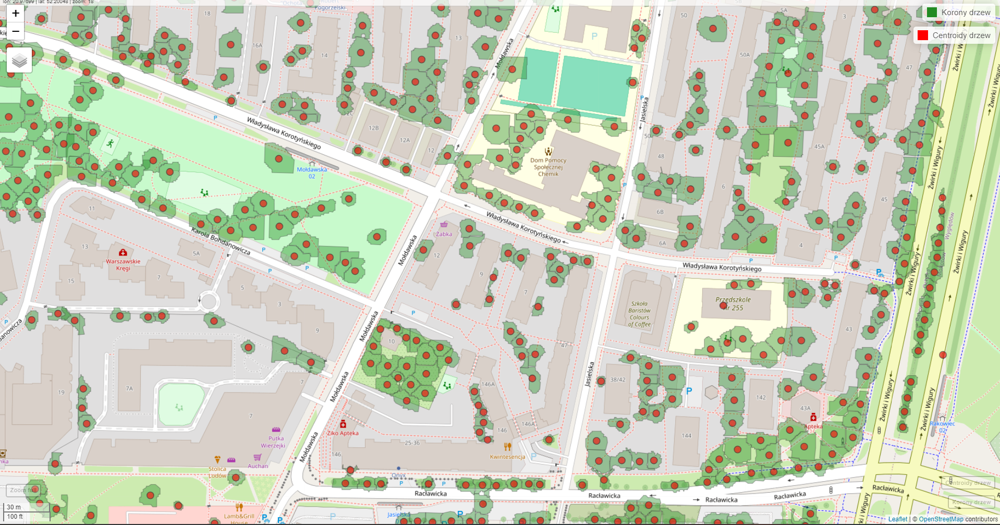

# Tree Segmentation on ALS LiDAR Data

This project performs automatic segmentation of individual trees and calculates their attributes (location, height, crown area) in urban and semi-urban environments, using ALS data provided by GUGiK via the [geoportal.gov.pl](https://geoportal.gov.pl) platform.

---

## Repository Structure
*Due to the size of the final files, I present only part of the full effect of the script.

```
├── output/                   # Output directory
│   ├── centroids/            # Tree crown centroids (.geojson)
│   ├── crowns/               # Tree crown outlines (.geojson)
│   ├── chm/                  # Canopy Height Models per tile and merged mosaic
├── tree_segmentation.R       # Main R script
├── images/                   # Screenshots and gifs
└── README.md
```

---

## Required Environment

- R (4.4.2)
- lidR (≥ 4.1.2)
- terra (≥ 1.8.15)
- sf (≥ 1.0.19)
- dplyr, mapview, fs, stringr

---

## Input Data (ALS LiDAR)

- Point density: 12 pts/m²
- Projection: EPSG:2180 (PL-1992), PL-EVRF2007-NH vertical reference
- Acquisition date: September 5th, 2023
- Sample tiles:

```
https://opendata.geoportal.gov.pl/NumDaneWys/DanePomiaroweLAZ/78044/78044_1402254_N-34-138-B-d-4-2-1-2.laz
https://opendata.geoportal.gov.pl/NumDaneWys/DanePomiaroweLAZ/78044/78044_1402253_N-34-138-B-d-4-2-1-1.laz
https://opendata.geoportal.gov.pl/NumDaneWys/DanePomiaroweLAZ/78044/78044_1402255_N-34-138-B-d-4-2-1-3.laz
https://opendata.geoportal.gov.pl/NumDaneWys/DanePomiaroweLAZ/78044/78044_1402256_N-34-138-B-d-4-2-1-4.laz
```

---

## Workflow and Key Steps

1. Load data using `readLAScatalog()` and filter by class 2/4/5 (ground, medium, high vegetation).
2. Automatically create output directories.
3. For each tile:
   - Normalize height (`normalize_height()`),
   - Generate CHM (`rasterize_canopy()` + `pitfree()`),
   - Smooth CHM (`terra::focal()`),
   - Detect tree tops (`locate_trees()` + `lmf()`),
   - Segment point cloud (`segment_trees()` + `dalponte2016()`),
   - Assign global `treeID`,
   - Export segmented `.laz` files with treeID attribute,
   - Delineate crowns (`delineate_crowns()` with `concave`),
   - Calculate centroids (`st_centroid()`),
   - Export `.geojson` files.
     
     

4. Merge results across the AOI (`crowns_all.geojson`, `CHM_merged.tif`).
5. Handle buffer zone duplicates:
   - Create 20m buffer around tiles,
   - Compute intersections,
   - Remove duplicates based on overlap threshold (70%).
6. Export cleaned and removed crowns/centroids.
7. Generate interactive map (`mapview`) and basic tree statistics.

---

## Basic Statistics

- **TOP 3 tallest trees**
- **TOP 3 largest crown areas**
- **Crown metrics table (Z, area, npoints)**

---

## Visualization

- Interactive map (`mapview`) of tree crowns and centroids.
  
- Point cloud colored by `treeID` for each tile.
  
  

- Ability to inspect individual trees using `treeID`.
  

---
## Citation
- Dalponte M. et al., 2016 – metoda segmentacji (`dalponte2016()`)
- Silva C. et al., 2016 – Local Maxima Filter (`lmf()`)
- Khosravipour A. et al., 2014 – Pit-free CHM

---
## Contact

Author: Bartosz Gajda  
Data source: [geoportal.gov.pl](https://geoportal.gov.pl)

---

## License

This project is licensed under the MIT / Creative Commons BY-SA License (choose your preferred license).
